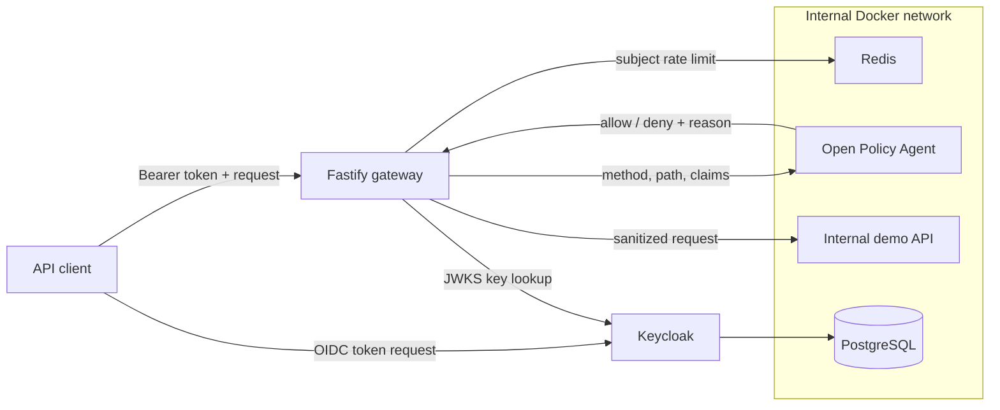

# Zero Trust API Gateway

[](https://github.com/German4341374/zero-trust-api-gateway/actions/workflows/ci.yml)
[](https://nodejs.org/)
[](https://www.openpolicyagent.org/)
[](LICENSE)

Put a gateway in front of a local API and try requests with different tokens and permissions.
It checks identity, asks OPA whether the request is allowed, and uses Redis for rate limits
before forwarding to a fixed upstream service.

The demo includes denied requests and dependency failures. If a required check can't finish,
the gateway denies access rather than letting the request through.

## Why this project matters

An API gateway should not trust a request merely because it reached an internal network. This project verifies every bearer token, evaluates every route through policy-as-code, limits each subject, and forwards only to a preconfigured service. Security dependency failures deny traffic rather than silently weakening controls.

## Highlights

- OIDC access-token verification with cached remote JWKS, pinned `RS256`, issuer, audience, expiry, and required-claim checks
- Default-deny OPA policies for profile access, administrator access, and tenant isolation
- Atomic Redis rate limiting keyed by a non-reversible subject fingerprint
- Fixed-origin proxy with header allowlisting, redirect blocking, request/response size limits, and timeouts
- Structured audit logs with request IDs and no bearer tokens, cookies, passwords, or raw subject IDs
- Keycloak realm import with short-lived local demo tokens and separate viewer/admin identities
- Fail-closed behavior when Redis or OPA is unavailable
- Multi-stage, non-root, read-only container with dropped Linux capabilities
- Unit, handler, Rego policy, Compose smoke, Dockerfile lint, dependency audit, and image vulnerability checks

## Architecture



The gateway is the only route to the demo upstream. User-supplied hosts, forwarded authorization headers, cookies, and redirects are not supported.

## Technology stack

| Component                             | Purpose                                |
| ------------------------------------- | -------------------------------------- |
| TypeScript 6 / Node.js 24 / Fastify 5 | Strictly typed gateway and demo API    |
| `jose`                                | JWT and JWKS validation                |
| Open Policy Agent 1.17                | Versioned authorization policy         |
| Keycloak 26.7                         | Local OpenID Connect identity provider |
| Redis 8.8                             | Atomic per-subject request limiting    |
| PostgreSQL 18                         | Durable Keycloak storage               |
| Docker Compose                        | Reproducible isolated environment      |
| Vitest, ESLint, Prettier              | Tests and code quality                 |

## Prerequisites

- Windows 11 with WSL2 or a recent Linux distribution
- Node.js 24 and npm 11 for local checks
- Docker Desktop with WSL2 integration, or Docker Engine with Compose v2, for the full environment
- GNU Make is optional; every Make target maps to a documented command

## Quick start

```bash
git clone https://github.com/German4341374/zero-trust-api-gateway.git
cd zero-trust-api-gateway
npm ci
npm run check
docker compose up --build -d
node scripts/smoke.mjs
```

Stop the environment without deleting the identity database:

```bash
docker compose down
```

Delete all local containers and the disposable database volume:

```bash
make clean
```

## Manual API demonstration

The imported users and passwords are intentionally disposable development values. Never reuse them.

```bash
TOKEN=$(curl -fsS -X POST http://localhost:8180/realms/portfolio/protocol/openid-connect/token \
  -H 'Content-Type: application/x-www-form-urlencoded' \
  --data-urlencode 'grant_type=password' \
  --data-urlencode 'client_id=gateway-demo' \
  --data-urlencode 'username=viewer' \
  --data-urlencode 'password=local-demo-viewer' | jq -r '.access_token')

curl -i http://localhost:8080/proxy/api/profile \
  -H "Authorization: Bearer $TOKEN"

curl -i http://localhost:8080/proxy/api/tenants/acme/orders \
  -H "Authorization: Bearer $TOKEN"

# Expected policy denial: viewer is not an administrator.
curl -i http://localhost:8080/proxy/api/admin \
  -H "Authorization: Bearer $TOKEN"
```

Do not enable shell tracing while a token variable is present. Tokens expire after five minutes.

## Policy model

The Rego policy is default deny and permits only three examples:

| Request                            | Requirement                     |
| ---------------------------------- | ------------------------------- |
| `GET /api/profile`                 | Valid authenticated identity    |
| `GET /api/admin`                   | `admin` realm role              |
| `GET /api/tenants/{tenant}/orders` | Token tenant equals path tenant |

Run policy tests independently:

```bash
docker run --rm -v "$PWD/policies:/policies:ro" openpolicyagent/opa:1.17.0 test /policies
```

## Verification commands

```bash
npm run format:check   # formatting
npm run lint           # strict lint rules
npm run typecheck      # TypeScript without emitting files
npm run test:coverage  # unit and handler tests with thresholds
npm run build          # production compilation
npm audit --audit-level=high
docker compose config --quiet
node scripts/smoke.mjs # after docker compose up
```

GitHub Actions also runs Hadolint, Trivy, Rego tests, and the full Compose smoke path on an isolated runner.

## Security decisions

- Authentication and authorization are separate: Keycloak proves identity; OPA decides access.
- The access-token algorithm is pinned. Issuer, audience, expiry, subject, and signature are mandatory.
- The browser-facing issuer and the internal JWKS URL are separate so local Docker DNS does not weaken issuer checking.
- The gateway generates trusted identity headers after discarding client-supplied equivalents.
- OPA and Redis errors return `503`; they never grant access.
- The upstream origin is configuration, not request input, reducing SSRF risk.
- Only safe request headers and the upstream `Content-Type` are propagated.
- Images run with restricted capabilities and internal services have no host ports.
- CI uses read-only GitHub token permissions and pinned action commits.

See [architecture and trust boundaries](docs/architecture.md) and the [authorization outage runbook](docs/runbooks/authorization-outage.md).

## Development versus production

| Local demonstration                      | Production expectation                                   |
| ---------------------------------------- | -------------------------------------------------------- |
| Keycloak `start-dev` and fake users      | Hardened, patched, highly available identity provider    |
| HTTP on loopback and internal bridge     | TLS/mTLS, trusted certificates, and controlled ingress   |
| In-memory Redis persistence disabled     | Authenticated Redis with HA and protected backups        |
| Policy files mounted from the repository | Signed OPA bundles promoted through CI                   |
| Fixed-window limit                       | Capacity-tested token bucket or sliding-window design    |
| Container JSON logs                      | Immutable centralized audit sink with retention controls |

## Troubleshooting

- **`401 unauthenticated`** — obtain a new token, then check issuer and audience. Do not paste the token into an issue.
- **`403 forbidden`** — inspect the policy tests and the sanitized authorization decision reason.
- **`503 dependency_unavailable`** — check Redis and OPA using the [runbook](docs/runbooks/authorization-outage.md).
- **Keycloak is still starting** — its first database migration can take longer on a cold machine; inspect `docker compose logs keycloak`.
- **Ports are busy** — stop conflicting services on `8080` or `8180`, or change only the host side of each Compose mapping.

## Limitations

- This is a local engineering demonstration, not a general-purpose production gateway.
- It proxies JSON-oriented HTTP traffic to one origin; WebSockets, streaming uploads, multipart forms, and gRPC are intentionally out of scope.
- The included password grant is used only to make an automated local demo possible. Production clients should use an appropriate modern OAuth flow.
- Rate-limit state is a single Redis instance and the fixed-window algorithm permits boundary bursts.
- The audit trail is structured stdout, not tamper-evident storage.
- TLS termination, certificate rotation, distributed tracing, and multi-region identity failover are not included.

## Next security exercises

- Sign and distribute versioned OPA bundles.
- Add mTLS and workload identity between the gateway and upstream services.
- Export authorization metrics and traces to an observability backend.
- Add a token-bucket limiter with per-route quotas.
- Add external immutable audit storage and retention policies.
- Exercise key rotation, Redis failover, and policy rollback in controlled chaos tests.

## Design questions

- Why authentication, authorization, and rate limiting are independent controls
- How issuer/audience/algorithm validation prevents common JWT mistakes
- Why a fixed upstream and header reconstruction reduce SSRF and identity-spoofing risk
- How default-deny policy and fail-closed dependencies change failure behavior
- The difference between a policy decision log and an application debug log
- Fixed-window rate-limit trade-offs and how to evolve the design
- How internal networks and non-root containers provide defense in depth
- What would be required before using this architecture for production traffic

## License

[MIT](LICENSE)
